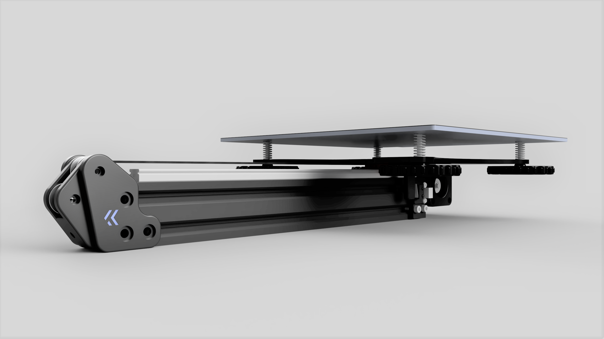
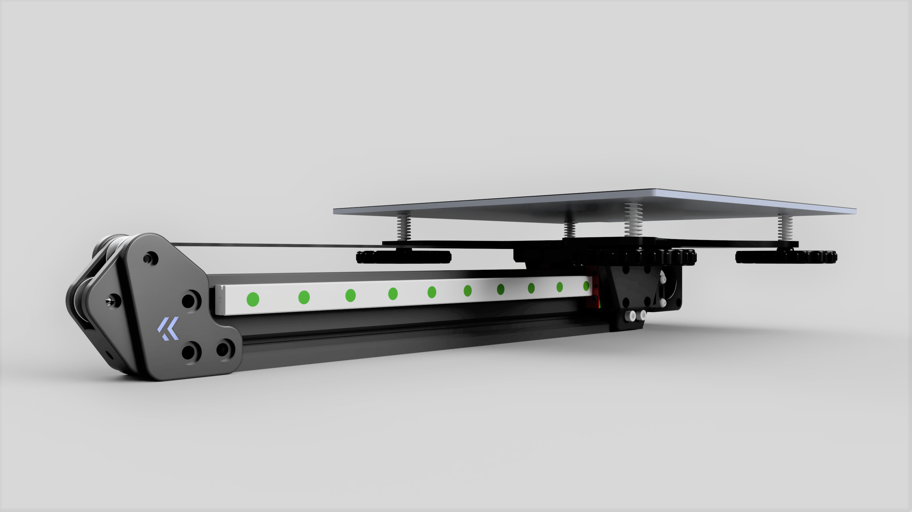
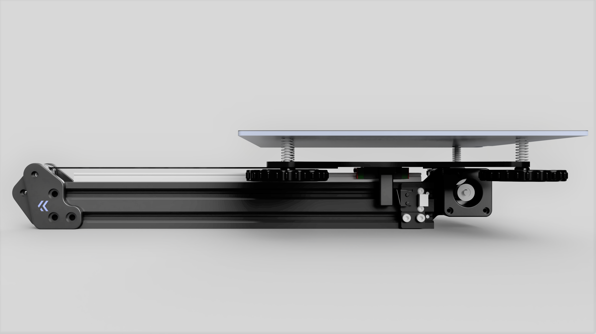
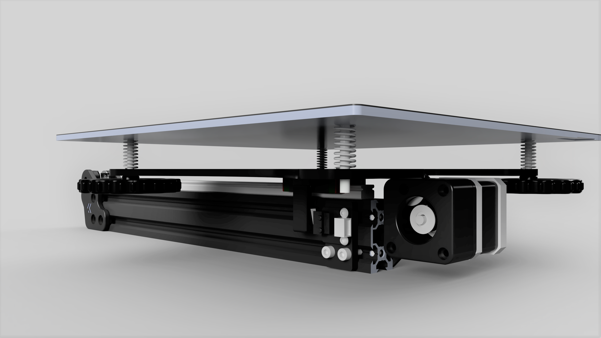
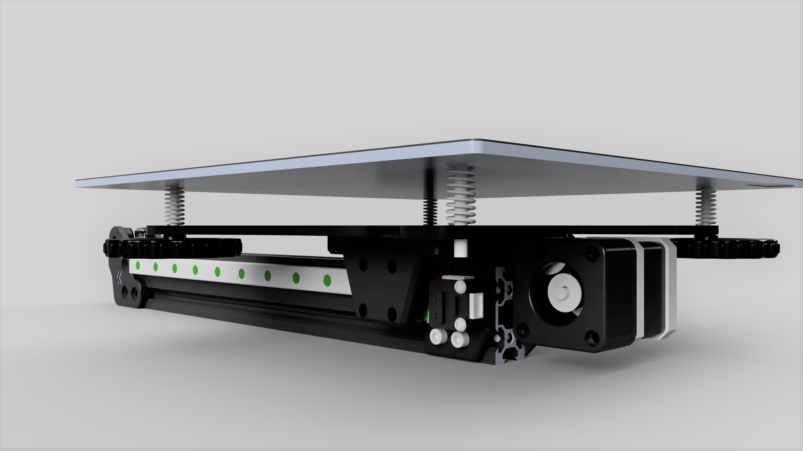

# Y Axis Linear Rail Mod for the Ender3
Upgrade your Ender 3 to a single or dual rail Y Axis. Ender 3 Pro and Ender 3 V2 will be supported later.

1: Single Rail        |  2: Dual Rail
:-------------------------:|:-------------------------:
  |  
  |  
  |  

## Why?
Just for fun, the Ender 3 prints very well even with the V Wheehls. The goal of this mod is not to reuse as many parts as possible from the Ender 3, but to create a very good working rail conversion for the Y axis. It includes parallel belt paths and a belt tensioner. All belts are guided by 20T idlers. The original metal motor plate of the Y-axis is reused to make everything as stable as possible.

## What?
There are two versions of the mod: Single Rail and Dual Rail. Both are compatible with each other, which means if you want to switch from single to dual (or the other way around), you don't have to reprint all the parts.

## How?
### Single Rail:
To attach the Single Rail to the Y Plate you need to drill 4 holes in it. I designed a drill guide that makes drilling very easy, even with a cordless screwdriver. Little pro tip: If the holes should be misaligned even with the drill guide, one, maximum two holes can be drilled out to 4mm. the other two holes align the Y Plate, and the two 4mm holes are used for additional attachment. ~~The single rail version uses an arm to reach the endstop. The endstop itself stays in the stock position with the stock braket.~~ Just use a screw for this, take a look at the BOM.
### Dual Rail:
The Dual Rail version does not need to be drilled. Instead, a printed adapter attaches the two rails to the Y Plate. A total of 6 screws fix the Y Plate to the printed part. With the dual rail setup it is very important that both rails are parallel, otherwise it is very difficult to move the Y axis. See my video explaining how to align the rails (video coming soon). The dual rail version needs a new endstop braket.

## How to print?
All parts are already aligned in the optimal position for printing. Support is not needed. Use at least PETG or better ABS (+) to print the parts. My settings: 5 walls/top/bottom, 55% infill.

## What do I need to build it?
```
## Common ##
4* M3x25
2* M3x16
1* M3x8 
3* M3 Hexnut
1* min. M5x12 (depends how you deep you tap the profile)
6* M5x8 (to mount the tensioner)
6* M5 tnut (to mount the tensioner)
1* 20T-5 Pulley (replaces stock pulley)
3* 20T-3 Idler (2 in the front, 1 in the back)
2 Meter GT2 6mm Belt (Glassfiber reinforced (no steel!))
M5 tapping tool (to tap the lower profile hole on the front for the tensioner)

## Dual ##
2* MGN-12H-300mm
32* M3x8 (8 to mount Printed Block to rail; 12 per rail for all holes (use min 6 per rail!))
24* M3 tnut (see one above)
4* M5x12
4* M5 locknut

## Single ##
4* M3x6
12* M3x8 (12 for all holes on the rail(use min 6 per rail!))
12* M3 tnut (see one above)
1* M5x35 (Use this as new endstop trigger, you can use an M3/M4 as well, than add a washer to the head)
1* M5 locknut (or M3/M4 if you went for an M3/M4 for the trigger one above)
3mm drill bit (to drill the holes in the plate for the MGN) ```
